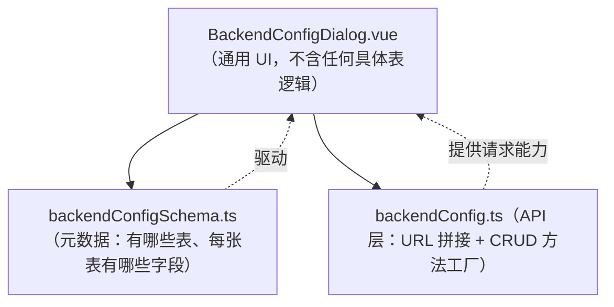

我先看一下当前打开的 BackendConfigDialog.vue 文件，理清它的增删改查逻辑。


这个组件是"配置驱动"的。我再看两个关键文件：schema 定义和 API 定义，才能完整说清增删改查的链路。


我已经把三个核心文件都读完了。这个模块是**完全"配置驱动"（元数据驱动）**的设计，理解这一点后，加表/加字段就非常简单了。下面给你完整梳理。

## 一、整体架构：三层职责分离



关键点：**`.vue` 文件里没有任何一张表、任何一个字段是写死的**。它只是读取 schema 元数据，动态渲染表格列和表单项，再调用 API 层。所以绝大多数改动你根本不用碰 `.vue`。

三个文件各自的职责：

| 文件 | 职责 | 什么时候改 |
|------|------|-----------|
| `backendConfig.ts` | 定义表 key 类型、主键映射、URL、CRUD 方法 | 加**新表**时 |
| `backendConfigSchema.ts` | 定义每张表的字段元数据（label/类型/是否必填等） | 加**新表**或改**字段**时 |
| `BackendConfigDialog.vue` | 通用渲染引擎 | 一般**不用改** |

## 二、增删改查的完整链路

以当前选中的表 `activeKey`（比如 `intentDefinition`）为例：

**查（列表/分页）**
```
loadPage() 
  → backendConfigApi[activeKey].page({pageNum, pageSize})
  → GET /api/intentDefinition/page
  → resp.data.records 填到 rows，resp.data.total 填到 total
  → el-table 遍历 tableColumns（来自 schema 的 fields）渲染列
```

**增**
```
点"新增" → openForm()（无 row）
  → buildEmptyForm(def) 按字段类型给初值
  → formMode = 'create'，主键置 null
  → 填表单 → handleSubmit()
  → 必填校验 / JSON 校验 / 剔除 readonly 字段
  → api.save(payload) → POST /api/intentDefinition
```

**改**
```
点"编辑" → openForm(row)
  → 把 row 的值回填到 form（json/array 字段回填到 draft 文本）
  → formMode = 'edit'，editingId 记录主键
  → handleSubmit() → payload 带上主键 → api.update(payload) → PUT /api/intentDefinition
```

**删**
```
点"删除" → handleDelete(row)
  → 取 row[idField] → ElMessageBox 确认
  → api.remove(id) → DELETE /api/intentDefinition/{idField}/{id}
```

**详情**：`openDetail` 其实就是 `openForm(row)` 后把 `formMode` 设成 `'view'`，所有字段变只读。

## 三、字段元数据（FieldDef）的含义

这是最核心的配置单元，schema 里每个字段就是一个 `FieldDef`：

```ts
{
  prop: 'intentName',   // 后端字段名（必须和数据库/接口一致）
  label: '意图名称',     // UI 显示的中文名
  kind: 'text',         // 决定用什么控件渲染（见下表）
  isId?: true,          // 是否主键（新增禁用、编辑只读）
  required?: true,      // 是否必填（提交前校验）
  inTable?: false,      // false = 不在列表显示（只在表单里）
  inForm?: false,       // false = 不在表单显示
  readonly?: true,      // 只读（如后端自动维护的时间戳），提交时会被剔除
  numberType?: 'int'|'float',  // 数字精度
  width?: 140,          // 表格列宽
  placeholder?: '...'   // 输入提示
}
```

`kind` 决定渲染的控件：

| kind | 控件 |
|------|------|
| `text` | 单行输入框 |
| `textarea` | 多行文本 |
| `number` | 数字输入框（int/float） |
| `boolean` | 开关 switch |
| `datetime` | 时间输入框 |
| `json` | textarea + JSON 校验 |
| `stringArray` | textarea，一行一个，转成数组 |

---

## 四、你的两个具体场景怎么改

### 场景 A：给现有表加一个字段 / 改一个字段

**只改 `backendConfigSchema.ts` 一个文件即可，不用碰 `.vue` 和 API。**

比如给"意图定义"表加一个 `remark` 备注字段：

```ts|CODE_EDIT_BLOCK|g:\project\dashboard\src\views\project\NetWork\backendConfigSchema.ts
// ... existing code ...
      { prop: 'categories', label: '分类', kind: 'number', numberType: 'int', width: 80 },
      { prop: 'remark', label: '备注', kind: 'textarea', inTable: false },
      createdAtField,
      updatedAtField,
// ... existing code ...
```

改字段同理——找到那一行改 `label` / `kind` / `required` / `width` 等属性即可。比如把某个字段从列表隐藏，加 `inTable: false`；改成必填，加 `required: true`。

⚠️ 前提：`prop` 必须和后端接口返回/接收的字段名一致，`kind` 要和后端数据类型匹配。改完前端会自动生效（表格列、表单项、校验、提交 payload 全部跟着 schema 走）。

### 场景 B：数据库新增一张表

需要改 **两个文件**：`backendConfig.ts`（API）+ `backendConfigSchema.ts`（元数据）。假设新表叫 `userProfile`，主键 `userId`，后端接口遵循同样的 `/api/userProfile/...` 规范。

**第 1 步：`backendConfig.ts` 注册表 key、主键、API 实例**

```ts|CODE_EDIT_BLOCK|g:\project\dashboard\src\api\backendConfig.ts
// ... existing code ...
export type BackendTableKey =
  | 'skillParamDefinition'
  | 'sessionSkillConversation'
  | 'sessionFileRecord'
  | 'sessionExecutionInstance'
  | 'sessionDialogueLog'
  | 'intentSkillConfig'
  | 'intentDefinition'
  | 'difySkillRegistry'
  | 'difyFileUpload'
  | 'userProfile'

/** 各表主键字段（URL 中的 path 参数名） */
export const TABLE_ID_FIELD: Record<BackendTableKey, string> = {
  skillParamDefinition: 'paramId',
  sessionSkillConversation: 'id',
  sessionFileRecord: 'fileId',
  sessionExecutionInstance: 'instanceId',
  sessionDialogueLog: 'id',
  intentSkillConfig: 'configId',
  intentDefinition: 'intentId',
  difySkillRegistry: 'skillId',
  difyFileUpload: 'id',
  userProfile: 'userId',
}
// ... existing code ...
export const backendConfigApi = {
  skillParamDefinition: createTableApi('skillParamDefinition'),
  sessionSkillConversation: createTableApi('sessionSkillConversation'),
  sessionFileRecord: createTableApi('sessionFileRecord'),
  sessionExecutionInstance: createTableApi('sessionExecutionInstance'),
  sessionDialogueLog: createTableApi('sessionDialogueLog'),
  intentSkillConfig: createTableApi('intentSkillConfig'),
  intentDefinition: createTableApi('intentDefinition'),
  difySkillRegistry: createTableApi('difySkillRegistry'),
  difyFileUpload: createTableApi('difyFileUpload'),
  userProfile: createTableApi('userProfile'),
} as const
```

如果这张表还提供 `/list/enabled` 接口，再把它加进 `ENABLED_LIST_TABLES` 数组，并在 schema 里设 `hasEnabledList: true`。

**第 2 步：`backendConfigSchema.ts` 增加表定义（会自动出现在左侧列表）**

```ts|CODE_EDIT_BLOCK|g:\project\dashboard\src\views\project\NetWork\backendConfigSchema.ts
// ... existing code ...
  {
    key: 'sessionDialogueLog',
    title: '对话原文日志',
    idField: 'id',
    jsonMode: true,
    fields: [],
  },
  {
    key: 'userProfile',
    title: '用户档案',
    idField: 'userId',
    fields: [
      { prop: 'userId', label: '用户ID', kind: 'number', isId: true, numberType: 'int', width: 90 },
      { prop: 'userName', label: '用户名', kind: 'text', required: true, width: 140 },
      { prop: 'age', label: '年龄', kind: 'number', numberType: 'int', width: 80 },
      { prop: 'isActive', label: '是否激活', kind: 'boolean', width: 100 },
      { prop: 'extra', label: '扩展信息', kind: 'json', inTable: false },
      createdAtField,
      updatedAtField,
    ],
  },
]
// ... existing code ...
```

改完这两步，新表就会自动出现在弹窗左侧的数据表列表里，增删改查、分页、表单、校验全部自动生效，**`.vue` 一行都不用动**。

> 特殊情况：如果新表后端没有暴露字段结构（Swagger schema 为空），就像 `sessionDialogueLog` 那样设 `jsonMode: true, fields: []`，界面会自动切换成"JSON 原文编辑"模式。

---

## 五、一句话总结改动清单

| 需求 | 改 `backendConfig.ts` | 改 `backendConfigSchema.ts` | 改 `.vue` |
|------|:---:|:---:|:---:|
| 加/改一个字段 | ❌ | ✅ | ❌ |
| 新增一张表 | ✅（key+主键+api 实例） | ✅（表定义+字段） | ❌ |
| 后端 URL 规范变了 | ✅ | ❌ | ❌ |
| 想加新的控件类型（如日期选择器） | ❌ | ✅（加 kind 类型） | ✅（加对应 `v-else-if` 分支） |

只有当你要引入一种**全新的字段控件类型**（现有 7 种 kind 不够用）时，才需要动 `.vue`——在 `FieldKind` 加类型，并在表单渲染的 `v-if/v-else-if` 链里加一个分支。

需要我帮你按某个具体的表结构或字段，直接把改动写出来吗？